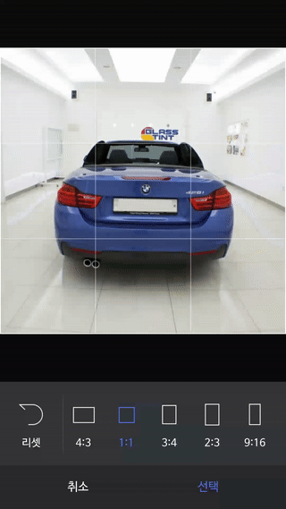

# ImageCropView
[](https://opensource.org/licenses/Apache-2.0) [](https://travis-ci.org/naver/android-imagecropview)  

An Android library that lets you implement image crop.
ImageCropView crops image by moving image under fixed crop area like instagram and iOS.  
Image zoom in/out is base on [sephiroth74's ImageViewZoom](https://github.com/sephiroth74/ImageViewZoom).  

## Screenshot
|                Screenshot               | in [PHOLAR](https://play.google.com/store/apps/details?id=com.naver.android.pholar) |
|:---------------------------------------:|:-------------------------------------:|
|    |      |

> Screenshot image source 
> http://bts.ibighit.com/photo.php

## Installation
[Android Studio](http://developer.android.com/sdk/index.html)  
Android SDK 28
Android SDK Build-tools 28.0.3  
(You can change other sdk and build-tools)  

## Usage
##### Gradle
```gradle
dependencies {
	implementation "com.naver.android.helloyako:imagecropview:1.2.3"
}
```
	
## ImageCropView Option
#### XML
```gradle
<com.naver.android.helloyako.imagecrop.view.ImageCropView
         xmlns:imagecrop="http://schemas.android.com/apk/res-auto"
         android:layout_width="match_parent"
         android:layout_height="match_parent"
         imagecrop:outsideLayerColor="#99000000"
         imagecrop:setInnerGridMode="on"
         imagecrop:gridInnerStroke="1dp"
         imagecrop:gridInnerColor="#66ffffff"
         imagecrop:setOuterGridMode="on"
         imagecrop:gridOuterStroke="1dp"
         imagecrop:gridOuterColor="#ffffff"/>
```

#### JAVA
```java
imageCropView.setGridInnerMode(ImageCropView.GRID_ON);
imageCropView.setGridOuterMode(ImageCropView.GRID_ON);
```


## Demo
[APK](https://github.com/naver/android-imagecropview/raw/master/apk/app-release.apk)  


## License
ImageCropView is licensed under the Apache License, Version 2.0.
See [LICENSE](LICENSE.txt) for full license text.

        Copyright (c) 2015 Naver Corp.
        @Author Ohkyun Kim

        Licensed under the Apache License, Version 2.0 (the "License");
        you may not use this file except in compliance with the License.
        You may obtain a copy of the License at

                http://www.apache.org/licenses/LICENSE-2.0

        Unless required by applicable law or agreed to in writing, software
        distributed under the License is distributed on an "AS IS" BASIS,
        WITHOUT WARRANTIES OR CONDITIONS OF ANY KIND, either express or implied.
        See the License for the specific language governing permissions and
        limitations under the License.
